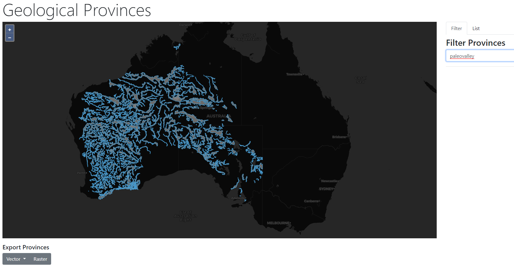

# Geological Provinces
Experiments with the Australian Geological Provinces Database (2018.01 Edition) using:
* Angular 8
* Openlayers 5
* lunr

Data from [Geoscience Australia](https://ecat.ga.gov.au/geonetwork/srv/eng/catalog.search#/metadata/116823) and converted to simplified GeoJSON using GDAL.

